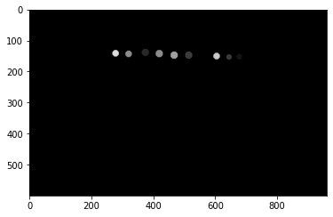

# MIL assignment : SIN segmentation 공부내용

## 1. numpy.unique() 함수


### 1.0 Reference
> https://www.delftstack.com/ko/api/numpy/python-numpy-unique/

> https://numpy.org/doc/stable/reference/generated/numpy.unique.html


### 1.1 예시 코드
```python
# np.unique() 사용법
import numpy as np
a = np.array([[2, 3, 4],
              [5, 4, 7],
              [4, 2, 3]])

np.unique(a)
```
```
# 출력 결과

array([2, 3, 4, 5, 7])
```


### 1.2 return_index=True 사용
```python
print(a, end='\n\n')

np.unique(a, return_index=True)
```
```
# 출력 결과

[[2 3 4]
 [5 4 7]
 [4 2 3]]

(array([2, 3, 4, 5, 7]), array([0, 1, 2, 3, 5]))
```
- 주어진 평탄화 된 입력 배열에서 정렬 된 고유 값 배열의 튜플과 각 고유 값의 `첫 번째 발생 인덱스 배열`을 제공합니다.


### 1.3 return_counts=True 사용
```python
print(a, end='\n\n')

np.unique(a, return_counts=True)
```
```
# 출력 결과

[[2 3 4]
 [5 4 7]
 [4 2 3]]

(array([2, 3, 4, 5, 7]), array([2, 2, 3, 1, 1]))
```
- 주어진 평면화 된 입력 배열에서 정렬 된 고유 값 배열의 튜플과 입력 배열에 `각 고유 값의 개수` 배열을 제공합니다.


### 1.4 return_inverse=True
```python
print(a, end='\n\n')

np.unique(a, return_inverse=True)
```
```
# 출력 결과

[[2 3 4]
 [5 4 7]
 [4 2 3]]

(array([2, 3, 4, 5, 7]), array([0, 1, 2, 3, 2, 4, 2, 0, 1]))
```
- 주어진 평면화 된 입력 배열에서 정렬 된 고유 값 배열의 튜플과 고유 배열의 인덱스 배열을 제공합니다.
- 여기서 2는 평면화 된 배열의 첫 번째 위치와 두 번째 마지막 위치에서 발생합니다. 마찬가지로 어떤 위치에서 어떤 값이 발생하는지 찾을 수 있습니다.


### 1.5 axis 매개 변수 사용
```python
b = np.array([[2,3,2],
            [2,3,2],
           [4,2,3]])

print(b, end='\n\n')

print(np.unique(b, axis=0), end='\n\n')
print(np.unique(b, axis=1), end='\n\n')
print(np.unique(b, axis=-1), end='\n\n')
```
```
# 출력 결과

[[2 3 2]
 [2 3 2]
 [4 2 3]]

[[2 3 2]
 [4 2 3]]

[[2 2 3]
 [2 2 3]
 [3 4 2]]

[[2 2 3]
 [2 2 3]
 [3 4 2]]

```
- `axis=0` : 입력 배열의 모든 고유 행을 제공합니다.
- `axis=1` : 입력 배열의 모든 고유 한 열을 제공합니다.


### 1.6 sample_image_GTD에 대한 np.unique() 값 출력


<br>

```python
np.shape(sample_image_GTD)

np.unique(sample_image_GTD)

np.unique(sample_image_GTD, return_index=True)
```

```
# 출력 결과

(600, 960, 3)

array([  0,  20,  40,  60, 140, 160, 200, 220], dtype=uint8)

(array([  0,  20,  40,  60, 140, 160, 200, 220], dtype=uint8),
 array([     0, 419619, 369747, 396087, 381402, 395946, 407880, 380982]))
```
- **np.unique(sample_image_GTD)**  
샘플 이미지에 대해 `np.unique()`를 사용하였다. 이미지가 unit8 데이터타입이므로, 출력할 수 있는 값은 0~255의 값이다. 해당 샘플 이미지의 경우, `[  0,  20,  40,  60, 140, 160, 200, 220]` 값을 가지며 이미지의 거의 대부분이 검정색이므로 0의 값을 가장 많이 가진다고 추측해볼 수 있다.

- **np.unique(sample_image_GTD, return_index=True)**  
`np.unique(sample_image_GTD, return_index=True)` : `return_index=True` 파라미터를 사용하여 `[  0,  20,  40,  60, 140, 160, 200, 220]` 값이 나오는 첫번째 배열에 대해 출력한 결과 `[     0, 419619, 369747, 396087, 381402, 395946, 407880, 380982]` 값을 얻을 수 있다.
- 샘플 이미지에서 0 다음으로 `가장 어두운 점(uint8의 값 : 20)`은 가장 마지막으로 보이는데, 이를 flattened array에서 보면 가장 큰 `419619` 값을 가지는 것을 확인할 수 있다. 이는 600*960의 shape을 가지는 이미지에서 419619번째 배열에 위치한다는 것을 의미한다.
- 다만 아쉬운 점은, 행열의 형태(좌표)가 아닌 flattened array로 출력되어 정확히 어느 곳에 위치한지를 알기 힘들다.


### 1.7 return_index=True & axis를 사용하여 sample_image_GTD 출력
```python
# axis=0 : 입력 배열의 모든 고유 행 제공
np.unique(sample_image_GTD, return_index=True, axis=0)
```
```
# 출력 결과

(array([[[0, 0, 0],
         [0, 0, 0],
         [0, 0, 0],
         ...,
         [0, 0, 0],
         [0, 0, 0],
         [0, 0, 0]],
 
        [[0, 0, 0],
         [0, 0, 0],
         [0, 0, 0],
         ...,
         [0, 0, 0],
         [0, 0, 0],
         [0, 0, 0]],
 
        [[0, 0, 0],
         [0, 0, 0],
         [0, 0, 0],
         ...,
         [0, 0, 0],
         [0, 0, 0],
         [0, 0, 0]],
 
        ...,
 
        [[0, 0, 0],
         [0, 0, 0],
         [0, 0, 0],
         ...,
         [0, 0, 0],
         [0, 0, 0],
         [0, 0, 0]],
 
        [[0, 0, 0],
         [0, 0, 0],
         [0, 0, 0],
         ...,
         [0, 0, 0],
         [0, 0, 0],
         [0, 0, 0]],
 
        [[0, 0, 0],
         [0, 0, 0],
         [0, 0, 0],
         ...,
         [0, 0, 0],
         [0, 0, 0],
         [0, 0, 0]]], dtype=uint8),
 array([  0, 162, 161, 160, 159, 158, 157, 156, 155, 128, 129, 130, 131, 154, 153, 132, 152, 133, 151, 134, 150, 135, 149, 136, 148, 137, 147, 138, 139, 146, 145, 140, 141, 142, 143, 144]))
```
- 위의 출력 결과를 보면 알 수 있듯이, 생략된 부분이 많은 것을 확인할 수 있다. 이를 전체 출력하기 위해 `1.7.1`를 참고한다.
- **두번째 array가 의미하는 바(추측)**  
샘플 이미지(GTD)를 보면, 유의미한 값(0이 아닌 값)을 가지는 행이 130 ~ 170번째 행에 위치하는 것을 대략적으로 확인할 수 있다. 두번째 array가 의미하는 것은, `입력 배열의 모든 고유 행을 출력`해준다는 의미이다. 다시 말해, 여러 행 중에 서로 중복된 값을 가지는 행이 있을 것이다. 예를 들면, 검정 바탕으로만 구성된 행은 모두 동일한 아래의 값(0만이 존재하는 배열)을 가질 것이다. 이런 중복된 행들 중 최초 배열의 행이 몇번째인지를 출력해주고, 나머지 중복된 행들이 몇번째 행인지에 대한 정보는 출력해주지 않는다.
```
...
         [  0,   0,   0],
         [  0,   0,   0],
         [  0,   0,   0],
         [  0,   0,   0],
         [  0,   0,   0],
         [  0,   0,   0],
         [  0,   0,   0],
         [  0,   0,   0],
         [  0,   0,   0],
         [  0,   0,   0],
         [  0,   0,   0],
         [  0,   0,   0],
         [  0,   0,   0],
         [  0,   0,   0],
         [  0,   0,   0],
         [  0,   0,   0],
         [  0,   0,   0],
         [  0,   0,   0],
         [  0,   0,   0],
         [  0,   0,   0],
         [  0,   0,   0],
         [  0,   0,   0],
         [  0,   0,   0],
         [  0,   0,   0],
         [  0,   0,   0],
         [  0,   0,   0],
         [  0,   0,   0],
...
```


### 1.7.1 생략된 부분 출력
> https://technical-support.tistory.com/47

```python
import numpy as np #numpy library
np.set_printoptions(threshold=np.inf, linewidth=np.inf) #inf = infinity 
```
```
# 출력 결과

출력 결과 전체를 출력한다. 거의 모든 값이 0이기 때문에 이에 대해서는 전체 출력값을 표기하지 않기로 한다. 다만, 1.7의 설명에 필요한 부분(0이 아닌 유의미한 값을 가지는 부분)만 예시로 표기해놓았다. 즉, 162번째 행과 161번째 행만을 아래에 출력해두었다.

...
(162번째 행의 유의미한 값)
         [  0,   0,   0],
         [  0,   0,   0],
         [  0,   0,   0],
         [  0,   0,   0],
         [  0,   0,   0],
         [  0,   0,   0],
         [  0,   0,   0],
         [ 60,  60,  60],
         [ 60,  60,  60],
         [ 60,  60,  60],
         [ 60,  60,  60],
         [ 60,  60,  60],
         [ 60,  60,  60],
         [ 60,  60,  60],
         [ 60,  60,  60],
         [ 60,  60,  60],
         [  0,   0,   0],
         [  0,   0,   0],
         [  0,   0,   0],
         [  0,   0,   0],
         [  0,   0,   0],
         [  0,   0,   0],

...
(161번째 행의 유의미한 값)
         [  0,   0,   0],
         [  0,   0,   0],
         [  0,   0,   0],
         [  0,   0,   0],
         [  0,   0,   0],
         [  0,   0,   0],
         [200, 200, 200],
         [200, 200, 200],
         [200, 200, 200],
         [200, 200, 200],
         [200, 200, 200],
         [200, 200, 200],
         [200, 200, 200],
         [200, 200, 200],
         [200, 200, 200],
         [  0,   0,   0],
         [  0,   0,   0],
         [  0,   0,   0],
         [  0,   0,   0],
         [  0,   0,   0],
         [  0,   0,   0],
         [  0,   0,   0],
         [  0,   0,   0],
         [  0,   0,   0],
         [  0,   0,   0],
         [  0,   0,   0],
         [  0,   0,   0],
         [  0,   0,   0],
         [  0,   0,   0],
         [  0,   0,   0],
         [  0,   0,   0],
         [  0,   0,   0],
         [  0,   0,   0],
         [  0,   0,   0],
         [  0,   0,   0],
         [  0,   0,   0],
         [  0,   0,   0],
         [  0,   0,   0],
         [  0,   0,   0],
         [  0,   0,   0],
         [  0,   0,   0],
         [  0,   0,   0],
         [  0,   0,   0],
         [  0,   0,   0],
         [  0,   0,   0],
         [ 60,  60,  60],
         [ 60,  60,  60],
         [ 60,  60,  60],
         [ 60,  60,  60],
         [ 60,  60,  60],
         [ 60,  60,  60],
         [ 60,  60,  60],
         [ 60,  60,  60],
         [ 60,  60,  60],
         [ 60,  60,  60],
         [ 60,  60,  60],
         [  0,   0,   0],
         [  0,   0,   0],
         [  0,   0,   0],
         [  0,   0,   0],
         [  0,   0,   0],
         [  0,   0,   0],
         [  0,   0,   0],
         [  0,   0,   0],
         [  0,   0,   0],
         [  0,   0,   0],
         [  0,   0,   0],
         [  0,   0,   0],
         [  0,   0,   0],
         [  0,   0,   0],
         [  0,   0,   0],
         [  0,   0,   0],
         [  0,   0,   0],
         [  0,   0,   0],
         [  0,   0,   0],
         [  0,   0,   0],
         [  0,   0,   0],
         [  0,   0,   0],
         [  0,   0,   0],
         [ 20,  20,  20],
         [ 20,  20,  20],
         [ 20,  20,  20],
         [ 20,  20,  20],
         [ 20,  20,  20],
         [ 20,  20,  20],
         [ 20,  20,  20],
         [ 20,  20,  20],
         [ 20,  20,  20],
         [  0,   0,   0],
         [  0,   0,   0],
         [  0,   0,   0],
         [  0,   0,   0],
         [  0,   0,   0],
         [  0,   0,   0],
         [  0,   0,   0],

...

```
***참고사항***
> 각 행마다 세 개씩 배열이 나열되어 있는 것을 확인할 수 있다. 이는 3-channel의 이미지(color)이기 때문으로 추측된다. 우리가 일반적으로 보는 color 이미지의 경우, RGB 총 3-channel로 구성되어 있으며 위의 이미지 또한 마찬가지이다. 육안으로 보기에 흑백 이미지처럼 보여, 1 채널 이미지(grayscale)라고 생각할 수 있다. 하지만 1-channel 이미지가 아닌 3-channel 이미지라는 것에 유의하도록 한다. 다만, 3-channel 흑백 이미지이기 때문에 각 채널의 값은 모두 동일한 것으로 추측된다. 예를 들면, [60, 60, 60]은 RGB 각 채널의 값이 모두 60으로 동일하다고 볼 수 있다.

> 위의 추측을 바탕으로, 출력된 값들을 쉽게 이해하려면 세로로 나열된 행을 그냥 가로로 나열하면 이해하기 쉽다. 세로로 나열된 배열을 직접 세어보았는데(14cm 자를 사용하여) 총 960개의 배열이 존재하는 것을 확인하였다. 이는 (600, 960, 3)의 shape을 갖는 샘플 이미지와 일맥상통한 것을 확인할 수 있다. 여기서 600은 열, 960은 행을 의미한다.


- **(162번째 행)**  
  162번째 행은 0이 아닌 유의미한 값을 가지는 마지막 행이며, 위의 결과를 통해 162번째 행은 60이라는 값을 가지는 배열이 존재한다는 것을 알 수 있다. 즉, 뒤에서 두번째 점이 샘플 이미지 상에서 0이 아닌 값 중, 제일 마지막 행에 위치한 것을 볼 수 있으며 네번째로 어두운(0, 20, 40 다음으로) 60이라는 값을 가지는 것을 유추해볼 수 있다. 뒤에서 두번째 점이 육안으로도 네번째로 어두운 색임을 관찰할 수 있다(검정바탕을 포함하는 것을 잊지말자).

- **(161번째 행)**  
  육안으로 샘플 이미지를 확인해보면, 뒤에서 첫번째 ~ 세번째 점이 다른 점들에 비해 아래쪽 행에 위치해 있는 것을 관찰할 수 있다. 이를 통해, 각각 200, 60, 20의 값을 가지는 것을 알 수 있다.

- 이러한 방법을 통해 다른 행들도 분석할 수 있으며, 이외의 행에 대한 분석은 생략하도록 한다.


## 2. 원본 이미지 & GTD 이미지 비교


- 1.7과 1.7.1의 분석 방법을 통해, 원본 이미지의 숫자는 GTD 이미지에서 고유한 값(배열, unit8)을 가지는 것을 확인할 수 있었다. 원본 이미지의 각 숫자에 대응하는 GTD 배열 값(uint8)이 무엇인지 아래에 정리하였다(위의 이미지에는 4, 5, 6, 9가 없어 이 값들이 존재하는 이미지를 추가로 불러와 분석하였음).

- `B : [220, 220, 220]`
- `7 : [140, 140, 140]`
- `2 : [ 40,  40,  40]`
- `7 : [140, 140, 140]`
- `8 : [160, 160, 160]`
- `3 : [ 60,  60,  60]`
- `0 : [200, 200, 200]`
- `3 : [ 60,  60,  60]`
- `1 : [ 20,  20,  20]`


- `B : [220, 220, 220]`
- `6 : [120, 120, 120]`
- `3 : [ 60,  60,  60]`
- `4 : [ 80,  80,  80]`
- `8 : [160, 160, 160]`
- `4 : [ 80,  80,  80]`
- `0 : [200, 200, 200]`
- `3 : [ 60,  60,  60]`
- `1 : [ 20,  20,  20]`


***참고사항***
> GTD의 라벨 값을 찾기 가장 쉬운 방법은, 9개의 문자가 모두 존재하는 행을 찾으면 된다. 그러고나서 순서대로 각 문자에 대응하는 라벨(배열) 값을 알아내면 된다. 유의미한 숫자를 찾아내는 방법은 `Ctrl+F`를 애용하자.

> 문자 1 ~ 9, 0, B는 순서대로 20씩 증가하는 라벨 배열 값을 갖는다.

> 실수로 5와 9가 누락되었으나, 20씩 증가하는 패턴을 가지기 때문에 각각 [100, 100, 100]와 [180, 180, 180]이라고 유추할 수 있다.

<br>

### 각 문자에 대한 GTD 라벨 배열 값

- `1 : [ 20,  20,  20]`
- `2 : [ 40,  40,  40]`
- `3 : [ 60,  60,  60]`
- `4 : [ 80,  80,  80]`
- `5 : [100, 100, 100]`
- `6 : [120, 120, 120]`
- `7 : [140, 140, 140]`
- `8 : [160, 160, 160]`
- `9 : [180, 180, 180]`
- `B : [220, 220, 220]`

